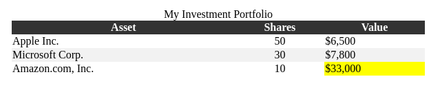

# SWE101: Programming Fundamentals

## Assessment 03 HTML-CSS Intermediate - OPTION 1

### Case Background

The previous two assessments provided you with a holistic understanding of your company’s vision of a digital platform that merges finance with aesthetics. Your recent success in enhancing the visual appeal of the platform resonates positively with the board. However, now there’s another challenge on the horizon.

As your company steps into the more complex domains of personal finance, the company realizes the necessity of providing its users with dynamic financial portfolios. Investors and potential clients have shown significant interest in a digital space where they can visualize their investments and financial assets in a comprehensive manner. With the market constantly in flux, having an adaptable and dynamic table is paramount.

Given the overwhelming data these tables will handle, it's crucial that they not only convey the necessary information but also do so in a format that's visually pleasing and easily navigable. The challenge here isn't just to represent data but to do it in a way that reflects the brand's commitment to sophistication and user-centric design.

You've already made a mark by making data aesthetically pleasing. Now, it's about adding layers of complexity without overwhelming the user. With your company set to launch its 'Digital Investment Wing', your role as a data analyst in this new venture is more important than ever.

### Objective

Drawing from your past successes, this assignment pivots towards a fresh challenge: the art of dynamic data representation. Your objective transcends beyond merely populating tables. As your company embarks on its 'Digital Investment Wing', you're tasked with designing a webpage that seamlessly integrates vast amounts of financial data in a digestible format. Your expertise as a data analyst will be judged not just on data accuracy but on how you bridge the gap between intricate financial data and user-friendly design. The vision is clear: a platform where users, irrespective of their financial knowledge, can navigate their investment portfolios with ease and clarity. Dive deep into the vast ocean of data and emerge with a design that speaks the universal language of simplicity and elegance.

### Section 1: Basic HTML structure (5 points)

#### Task 1.1

Create a new HTML file index.html and link it to a new CSS file styles.css. (5 points)

### Section 2: Creating a Table (30 points)

#### Task 2.1

Inside the BODY of your HTML file, create a TABLE with a CAPTION "My Investment Portfolio". The table should contain three columns: "Asset", "Shares", and "Value". Fill in some sample data (at least three rows). (30 points)

### Section 3: Styling with CSS (50 points)

#### Task 3.1

Style your table with the following requirements:

- Border-collapse set to collapse
- Width to 100%
- TH elements should have a background color and text color of your choice (15 points)

#### Task 3.2

Style the CAPTION of your table to be centered and have a text color of your choice. (5 points).

#### Task 3.3

Create a class highlight in your CSS. This class should give elements a yellow background color. In your HTML, assign the class highlight to the cell of your highest-value asset. (10 points)

#### Task 3.4

Position the table absolutely in the center of the page, both vertically and horizontally. (20 points)

### Section 4: Enhancements (Extra Credit - 15 points)

#### Task 4.1

Create a pseudo-class rule that changes the background color of a row when it is hovered over. (5 points)

#### Task 4.2

Using the nth-of-type pseudo-class, select even rows in your table and give them a light gray background color to create a striped effect. (5 points)

#### Task 4.3

Using the nth-of-type pseudo-class, select the 2nd td in your table and align the text to the center. (5 points)

---

## Assessment 03 HTML-CSS Intermediate - OPTION 2

### Pick one to clone

#### Coinhako

- Website: https://www.coinhako.com/
- Difficulty: 3/5

#### Agoda

- Website: www.agoda.com
- Difficulty: 4/5

#### Nodeflair

- Website: https://nodeflair.com/
- Difficulty:5/5

### Section 1: Nav bar (20 points)

In this challenge, the components don't have to be functional. Don't worry about the font-family too. Just get the positioning right.

#### Task 1.1

Most website have some form of nav bar. The task if to replicate the nav bar.

### Section 2: Hero (Up to 50 points)

#### Task 2.1

Depending on your challenge, look at the website as a bunch of component being put together. Work on each component indivually before bringing them together.

- Make sure to include any button hover effects
- For CoinHako, clone the section between the navbar and the scroll icon. You DO NOT have to make the card component move. (50 Points)
- For Agoda, include the search bar (50 Points)
- For Nodeflair, this involve the the entire section within the green background. (40 Points)

### Section 3: Body (Up to 40 points)

#### Task 3.1

For this task, clone the first row of the website body

- For CoinHako, clone the Buy, sell & swap cryptocurrencies like Bitcoin section (30 Points)
- For Agoda, clone the search feature that is in the hero area and put it in the `div` you created in task 2.1 (20 Points), and the Accommodation Promotions section. (30 Points)
- For Nodeflair, clone NodeFlair.Salaries to the first row that display the 3 job cards. (40 Points)

---

Expected outcome

### GitHub Guide

1. `$ git add .` this add all updated files to staging
2. `$ git commit -m "a random message"` this shift the staged updates to local repository.
3. `$ git push` this push the updated local repository to github repository.
